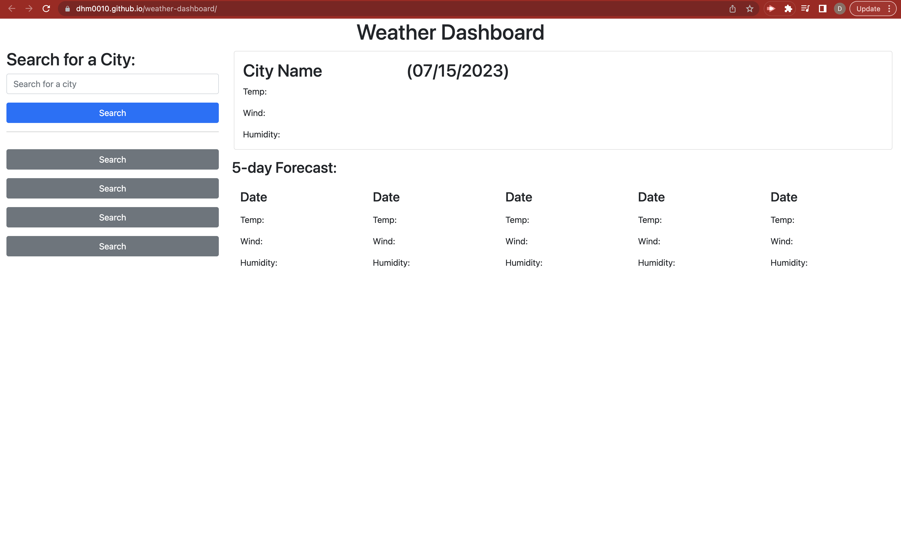

# weather-dashboard

## Description

in this project I used a server based API to retrieve weather conditions for a specific city when searched for. Unfortunately, i wasnt able to completely finish this project although all the tools are there for it to work. If you click on the search bar and input a city, the temp, wind speed and humidity for that city will show up.

## Installation

N/A

## Credit

MIT license

## Usage

